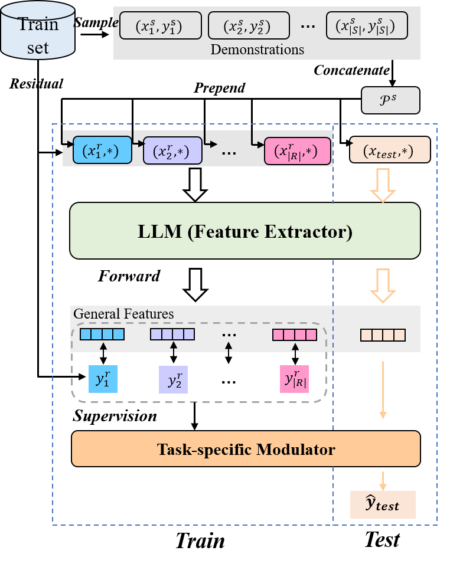

# FADS-ICL
Source code for the paper "Feature-Adaptive and Data-Scalable In-Context Learning" in ACL 2024 

<div  align="center">  

</div>  

## Preparation
### Environment
The code is tested under python==3.8.18, torch==1.12.0 and transformers==4.39.0, though the requirement of spefic version is not very strict, run with no bugs, then you are set.

**Note**: Almost all experiments is conducted on a single NVIDIA A800-SXM4-80GB, except for the llama-30B model which requires two. Besides, bitsandbytes (we use the 0.41.2 version) is needed in quantification for llama2-70B.
### Model
Prepare your LLM ([gpt2](https://huggingface.co/gpt2-xl/tree/main), [llama](https://huggingface.co/docs/transformers/model_doc/llama) or [llama2](https://huggingface.co/docs/transformers/model_doc/llama2)) in `./llm/`, I personally prefer download them myself and configure the local path in scripts.
### Data
[Download](https://drive.google.com/file/d/1Pzsfn7mTwu6kIGssHGcXMVLH7hmLuShV/view?usp=drive_link) dataset and unzip them in `./data`.\
The structure of the project looks like:
```
.
├── run_icl.sh
├── run_fads-icl.sh
├── icl.py
├── fads-icl.py
├── utils
│   ├── anchor.py
│   ├── dataset.py
│   ├── __init__.py
│   └── template.py
├── llm
│   └── gpt2-xl
│       ├── config.json
│       ├── merges.txt
│       ├── pytorch_model.bin
│       ├── tokenizer.json
│       └── vocab.json
└── data
    └── sst2
        ├── dev_subsample.jsonl
        ├── test.jsonl
        └── train.jsonl
```

## Run
Run FADS-ICL or In-Context Learning as follows, check the configuration in the script including dataset, llm, seed, etc.
```
bash run_fads-icl.sh
```
or
```
bash run_icl.sh
```
## Results
For the SST dataset, you shall get **exact** results w.r.t. random seeds as follows (invariant to different environment possibly):

| Seed                                | 1      | 2      | 3      | 4      | 5      |
| ----------------------------------- | ------ | ------ | ------ | ------ | ------ |
| **In-Context Learning** (gpt2-xl, 16-shot)   | 0.8438 | 0.8125 | 0.7227 | 0.8633 | 0.8242 |
| **FADS-ICL** (gpt2-xl, 16-shot) | 0.9063 | 0.8594 | 0.7344 | 0.9297 | 0.9023 |
| **FADS-ICL** (gpt2-xl, 128-shot) | 0.8945 | 0.8789 | 0.8828 | 0.8906 | 0.8984 |

Full results are listed in the paper (see Table 2 and Table 3).

<!-- ## Citation
 * If you have any quesitons, feel free to open an issue.
 * If you find this repo useful, please cite us as:

```bibtex
@inproceedings{li-etal-2022-improving-chinese,
    title = "Improving {C}hinese Spelling Check by Character Pronunciation Prediction: The Effects of Adaptivity and Granularity",
    author = "Li, Jiahao  and
      Wang, Quan  and
      Mao, Zhendong  and
      Guo, Junbo  and
      Yang, Yanyan  and
      Zhang, Yongdong",
    booktitle = "Proceedings of the 2022 Conference on Empirical Methods in Natural Language Processing",
    month = dec,
    year = "2022",
    address = "Abu Dhabi, United Arab Emirates",
    publisher = "Association for Computational Linguistics",
    url = "https://aclanthology.org/2022.emnlp-main.287",
    pages = "4275--4286",
    abstract = "Chinese spelling check (CSC) is a fundamental NLP task that detects and corrects spelling errors in Chinese texts. As most of these spelling errors are caused by phonetic similarity, effectively modeling the pronunciation of Chinese characters is a key factor for CSC. In this paper, we consider introducing an auxiliary task of Chinese pronunciation prediction (CPP) to improve CSC, and, for the first time, systematically discuss the adaptivity and granularity of this auxiliary task. We propose SCOPE which builds upon a shared encoder two parallel decoders, one for the primary CSC task and the other for a fine-grained auxiliary CPP task, with a novel adaptive weighting scheme to balance the two tasks. In addition, we design a delicate iterative correction strategy for further improvements during inference. Empirical evaluation shows that SCOPE achieves new state-of-the-art on three CSC benchmarks, demonstrating the effectiveness and superiority of the auxiliary CPP task. Comprehensive ablation studies further verify the positive effects of adaptivity and granularity of the task.",
}

``` -->